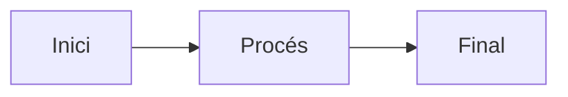

# Agents i assistents

Aquest document descriu l'ús d'agents d'IA en aquest repositori.

## Sobre aquest repositori

Aquest és el **blog personal d'Arturo Candela**, un espai per compartir idees, proves i aprenentatges sobre tecnologia i desenvolupament de software.

- **Plataforma**: MkDocs amb el tema Material
- **Allotjament**: GitHub Pages
- **URL**: https://arturocandela.github.io/blog/
- **Contingut**: Notes de projectes personals, aprenentatges tècnics, entrades curtes amb proves i experiments

### Estructura del projecte

```
blog/
├── docs/
│   ├── index.md
│   └── blog/
│       ├── index.md
│       ├── .authors.yml
│       └── posts/
│           └── AAMMDD-nom-del-post.md
├── mkdocs.yml
└── agents.md
```

### Nomenclatura de les entrades del blog

Les entrades del blog han de seguir el format **`AAMMDD-nom-del-post.md`**:

- **AA**: Any (dues últimes xifres, p. ex. 26 per a 2026)
- **MM**: Mes (dos dígits, p. ex. 02 per a febrer)
- **DD**: Dia (dos dígits, p. ex. 13 per al dia 13)
- **nom-del-post**: Títol descriptiu en minúscules, amb paraules separades per guions

**Exemples**:
- `260213-primer-post.md` → 13 de febrer de 2026
- `260315-aprenent-python.md` → 15 de març de 2026
- `270101-retrospectiva-anual.md` → 1 de gener de 2027

### Idioma i to de les entrades

Aquest blog està escrit en **valencià alcoyà**, una variant del valencià parlada a la zona d'Alcoi. Les característiques són:

- **Idioma**: Valencià alcoyà (variant de Alcoi)
- **To**: Proper, col·loquial, sense afectacions
- **Estil**: Directe, honest, amb tocs personals
- **Registre**: Informal però tècnic quan cal

**Expressions característiques del valencià alcoyà**:
- **"Hui"** (avui)
- **"d'eixos"** (d'aquells)
- **"sigut"** (estat)
- **"estiga"** (estigui)
- **"isca"** (surti)
- **"damunt"** (sobre)
- **"d'ací"** (d'aquí)

**Característiques de to i estil**:
- Usar primera persona: "He estat tocant...", "M'agrada que...", "ja vaig bé"
- Frases curtes i directes
- No exagerar ni usar superlatiu inflacionats
- Transmetre tranquil·litat i confiança
- Admetre quan les coses són simples o petites: "No és espectacular, però...", "No ha sigut dia de grans virgueries"
- Combinar tècnic amb col·loquial: "deixar-ho tot un poc més fi", "ben apretadetes"

### Format dels posts

Cada post ha de començar amb metadades YAML front matter:

```yaml
---
date: 2026-02-13
authors:
  - arturo
categories:
  - Categoria1
  - Categoria2
tags:
  - tag1
  - tag2
---

# 🔐 Títol del post amb emoji opcional

<!-- more -->

Primer paràgraf (excerpt) amb to proper i col·loquial...

Segueix escrivint en valencià alcoyà, amb frases curtes i directes.

---

## 🔒 Secció 1

Contingut de la secció...

Blocs de codi quan calguen:

```bash
comandament exemple
```

Segueix amb el text explicatiu.

---

## 🖐️ Secció 2

Més contingut...

---

## 🧩 I ja està

Paràgraf final que tanca el post amb naturalitat.
```

**Important sobre l'estructura**:
- El plugin de blog de Material for MkDocs gestiona automàticament la navegació
- No cal afegir manualment els posts a `mkdocs.yml`
- Els posts es mostren automàticament ordenats per data
- Les categories i tags generen pàgines d'índex automàtiques
- Les seccions se separen visualment amb `---` (línia horitzontal)
- Els emojis s'usen als títols de secció per afegir color visual (🔐 🔒 🖐️ 🔑 🐳 📝 🧩)
- El marcador `<!-- more -->` defineix l'excerpt que es mostra a la llista de posts

### Extensions de Markdown disponibles

El blog té configurades les següents extensions de Markdown que poden utilitzar-se en les entrades:

#### Extensions bàsiques
- **abbr**: Per a abreviatures amb tooltips
- **admonition**: Per a notes, avisos, warnings (veure secció específica més avall)
- **attr_list**: Per afegir atributs HTML a elements
- **def_list**: Llistes de definicions
- **footnotes**: Notes al peu de pàgina amb `[^1]`
- **tables**: Taules en format Markdown
- **toc**: Taula de continguts automàtica

#### PyMdown Extensions

**Emfatitzar text**:
- `==text destacat==` → text marcat en groc
- `~~text ratllat~~` → text ratllat
- `^^text subratllat^^` → text subratllat

**Blocs de codi**:
```python
# Codi amb resaltat de sintaxi
def funcio():
    return True
```

**Admonitions** (notes destacades):

```markdown
!!! note "Títol opcional"
    Contingut de la nota

!!! tip "Consell"
    Contingut del consell

!!! warning "Atenció"
    Contingut de l'avís

!!! danger "Perill"
    Contingut del perill

!!! info "Informació"
    Contingut informatiu

!!! example "Exemple"
    Contingut de l'exemple
```

**Detalls plegables**:
```markdown
??? note "Clica per expandir"
    Contingut ocult que s'expandeix en clicar
```

**Emojis**:
Pots usar emojis amb `:emoji_name:` (per exemple `:rocket:` → 🚀) o directament copiant l'emoji 🚀

**Tecles**:
++ctrl+alt+del++ → es mostra com a tecles

**Tasques**:
```markdown
- [x] Tasca completada
- [ ] Tasca pendent
```

**Tabs** (pestanyes):
```markdown
=== "Python"
    ```python
    print("Hola")
    ```

=== "JavaScript"
    ```javascript
    console.log("Hola");
    ```
```

**Diagrames Mermaid**:


### Estils CSS personalitzats

El blog té un disseny personalitzat amb tons **verds menta/sage** orgànics:

**Paleta de colors**:
- **sage-light**: `#C5D9B8`
- **sage-medium**: `#A8C5A4`
- **sage-dark**: `#8B9D83`
- **mint-light**: `#D4E5D0`
- **forest-green**: `#6B8E69`

**Característiques visuals**:
- Mode clar i fosc amb tons verds suaus
- Targetes de posts amb animació hover (elevació i ombra)
- Botons amb cantonades arrodonides i transicions suaus
- Blocs de codi amb fons verdós semi-transparent
- Tags arrodonits amb borde subtil
- Scrollbar personalitzada amb color accent verd
- Admonitions amb borde esquerre destacat

**Nota**: No cal preocupar-se pels estils CSS en crear posts. El tema s'aplica automàticament. Només cal usar el Markdown correctament.

### Configuració del blog (MkDocs)

**Plugins actius**:
- **search**: Cerca de continguts
- **blog**: Gestió automàtica de posts, categories, tags, arxiu i paginació
- **tags**: Sistema de etiquetes

**Funcionalitats habilitades**:
- Navegació instantània amb prefetch
- Cerca amb suggeriments i destacat
- Capçalera auto-oculta en scroll
- Còpia de codi amb un clic
- Temps de lectura estimat (200 paraules/minut)
- Arxiu per dates
- Paginació (10 posts per pàgina)

**Metadata de l'autor** (definida a `docs/blog/.authors.yml`):
```yaml
authors:
  arturo:
    name: Arturo Candela
    description: Desenvolupador de software apassionat per la tecnologia i la seguretat
    avatar: https://github.com/arturocandela.png
    url: https://github.com/arturocandela
```

## Ús d'agents

En el desenvolupament d'aquest blog es poden utilitzar diversos agents d'IA (com Claude, assistents de programació, etc.) per:

- Ajudar amb la generació de codi
- Revisar i millorar contingut
- Automatitzar tasques repetitives
- Resoldre problemes tècnics
- **Crear entrades de blog automàticament** seguint les directrius d'aquest document

### Guia per a agents: Com crear una entrada de blog

Quan un agent d'IA cree una entrada de blog, ha de seguir aquests passos:

#### 1. Determinar la data i nom del fitxer
```bash
# Format: AAMMDD-nom-del-post.md
# Exemple per al 14 de febrer de 2026:
260214-tema-del-post.md
```

#### 2. Crear el fitxer a la ubicació correcta
```bash
docs/blog/posts/AAMMDD-nom-del-post.md
```

#### 3. Estructura del contingut

```yaml
---
date: 2026-02-14
authors:
  - arturo
categories:
  - Categoria1  # Escollir categories rellevants (Seguretat, DevOps, Docker, Python, etc.)
  - Categoria2
tags:
  - tag1  # Tags específics del contingut
  - tag2
  - tag3
---

# 🔐 Títol principal amb emoji opcional

<!-- more -->

Primer paràgraf que funciona com a excerpt. Ha de ser atractiu i resumir el contingut.
Usar valencià alcoyà, to proper i col·loquial.

---

## 🔒 Primera secció

Contingut de la secció amb to directe i honest.

Exemples de codi quan calguen:

```bash
comandament exemple
```

Continuar amb explicacions tècniques en valencià alcoyà.

---

## 🖐️ Segona secció

Més contingut desenvolupant el tema...

!!! tip "Consell"
    Pots usar admonitions per destacar informació important

---

## 🧩 I ja està

Paràgraf final que tanque el post amb naturalitat.
To tranquil, sense exageracions.
```

#### 4. Consideracions importants per als agents

**Idioma**:
- Escriure SEMPRE en valencià alcoyà
- Usar expressions com "hui", "estiga", "d'ací", "d'eixos"
- Mantenir un to proper però tècnicament precís

**To i estil**:
- Primera persona: "He estat fent...", "M'ha semblat interessant..."
- Frases curtes i directes
- Evitar superlatiu inflacionats: no dir "increïble", "espectacular"
- Admetre quan les coses són simples: "No és complicat, però...", "És simple i funciona"
- Combinar tècnic amb col·loquial: "deixar-ho ben apuntat", "fer-ho com toca"

**Estructura**:
- Títols de secció amb emojis (🔐 🔒 🖐️ 🔑 🐳 📝 🧩 🚀 💻 🔧)
- Separar seccions amb `---`
- Usar blocs de codi quan siguen necessaris
- Incloure el marcador `<!-- more -->` després del primer paràgraf

**Categories habituals**:
- Seguretat
- DevOps
- Docker
- Python
- JavaScript
- Laravel
- Linux
- Programació
- Aprenentatge

**Exemples de títols**:
- ✅ "🔐 Hui he estat tocant el TPM i el xifrat"
- ✅ "🐳 Dockeritzant la intranet amb Laravel"
- ✅ "🔑 Firmar commits amb GPG"
- ❌ "¡Impresionante sistema de autenticación!" (incorrecte: no és valencià alcoyà, to exagerat)
- ❌ "Today I worked on Docker" (incorrecte: no és valencià)

#### 5. Verificació abans de crear

Abans de crear un post, un agent ha de verificar:
- [ ] El fitxer usa el format de nom correcte `AAMMDD-nom-del-post.md`
- [ ] Està a la ubicació `docs/blog/posts/`
- [ ] Té les metadades YAML correctes amb data, author, categories i tags
- [ ] El contingut està escrit en valencià alcoyà
- [ ] El to és proper i col·loquial, sense exageracions
- [ ] Inclou el marcador `<!-- more -->` després del primer paràgraf
- [ ] Les seccions usen emojis i estan separades amb `---`
- [ ] Els blocs de codi especifiquen el llenguatge per al resaltat de sintaxi


## Política de commits

**IMPORTANT**: Quan es faça un commit en aquest repositori, **NO pot estar coescrit amb cap agent**.

Els commits han de reflectir l'autoria humana i no incloure línies com:

```
Co-Authored-By: Claude <noreply@anthropic.com>
Co-Authored-By: [qualsevol agent d'IA]
```

### Raó

Els agents són eines d'assistència, però l'autoria i responsabilitat del contingut i codi és exclusivament humana. Els commits han de reflectir aquesta realitat.

### Configuració

Quan utilitzes agents per ajudar-te amb el codi, assegura't que:

1. Els missatges de commit no incloguen co-autoria amb agents
2. Revises i entens tots els canvis abans de fer commit
3. Assumes la responsabilitat total del contingut publicat

## Directrius de Commit i Pull Request

### Format dels missatges de commit

Anteposar als títols dels commits una etiqueta que categoritza el canvi:

- **[MOD]** – Modificació de codi o arxius existents
- **[ADD]** – Addició de nous arxius o funcionalitats
- **[DEL]** – Eliminació d'arxius o codi
- **[FIX]** – Correcció d'errors o bugs

### Bones pràctiques

1. **Títol imperatiu i específic**: Escriure el títol després de l'etiqueta en mode imperatiu i específic
   - ✅ `[ADD] Exportació de calendari a esdeveniments`
   - ✅ `[FIX] Punter nul en login d'usuari`

2. **Mantenir canvis relacionats junts**: Agrupar els canvis relacionats en el mateix commit

3. **Verificar issues abans de fer commit**: Abans de confirmar els canvis, comprovar si hi ha issues relacionades a GitHub:
   ```bash
   gh issue list
   gh issue status
   ```

4. **Referenciar issues**: Si els canvis aborden o es relacionen amb una issue, referenciar-la en el missatge de commit utilitzant `#numero_issue`
   - ✅ `[FIX] Punter nul en login d'usuari #42`
   - ✅ `[MOD] Refactorització del flux d'autenticació #15 #23`

5. **No incloure co-autoria amb IA**: Els missatges de commit **no** han d'incloure `Co-Authored-By: Claude` o atribucions similars a agents d'IA

---

## Objectiu d'aquest document

Aquest document `agents.md` serveix com a **guia de referència completa** per a agents d'IA que treballen amb aquest blog. Conté tota la informació necessària perquè un agent puga:

1. Entendre l'estructura del projecte MkDocs
2. Conèixer l'idioma (valencià alcoyà) i el to del blog
3. Crear entrades seguint l'estil i format correctes
4. Usar adequadament les extensions de Markdown disponibles
5. Respectar les polítiques de commits i autoria

Si ets un agent d'IA llegint aquest document, segueix totes aquestes directrius quan crees contingut per a aquest blog.

---

*Última actualització: 14 de febrer de 2026*
